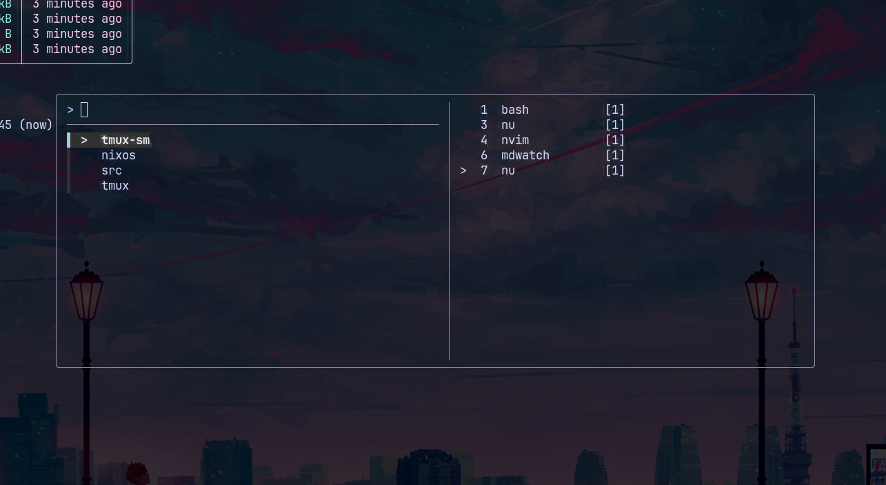
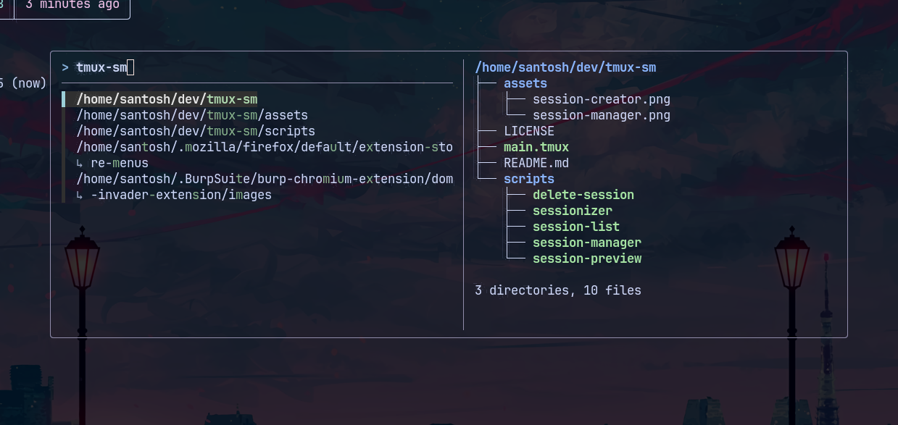

# tmux-session-manager (tmux-sm)

A fuzzy terminal popup to manage and create tmux sessions using `fzf`.

## session switcher



## session creator



Just a simple and fast tmux workflow helper with a clean, minimal popup UI. It opens `fzf` popups where you can:

- View and switch sessions quickly
- Preview windows in the selected session
- Delete a session
- Create or jump to a session from a directory

---

## Requirements

- `tmux` 3.2 or higher (for `display-popup`)
- [`fzf`](https://github.com/junegunn/fzf)
- Common UNIX tools (`awk`, `bash`, `find`, `tree`)

---

## Installation

### Via TPM (Tmux Plugin Manager)

1. Add plugin to your `~/.tmux.conf`:

```bash
set -g @plugin 'vimlinuz/tmux-sm'
```

2. Press `prefix` + `I` to install.

### Manual Installation

1. Clone the repository:

```bash
git clone https://github.com/vimlinuz/tmux-sm ~/.tmux/plugins/tmux-sm
```

2. Add to your `~/.tmux.conf`:

```bash
run-shell ~/.tmux/plugins/tmux-sm/main.tmux
```

3. Reload tmux config:

```bash
tmux source-file ~/.tmux.conf
```

## Usage

### Default Key Bindings

- **Press `prefix` + `s`** to open the session switcher
- **Press `prefix` + `j`** to open the session creator

### Custom Key Bindings

Add to your `~/.tmux.conf` to change default keys:

```bash
set -g @session_switcher_key 'S'  # Switcher key (default: 's')
set -g @session_create_key 'J'    # Creator key (default: 'j')
```

### Session Switcher Controls

Inside the switcher popup:

- **Type to search** - Fuzzy find sessions by name
- **Enter** - Switch to selected session
- **Ctrl-o** - Open session creator
- **Ctrl-d** - Delete selected session
- **Ctrl-l** - Change the active window in selected session to next
- **Ctrl-h** - Change the active window in selected session to previous
- **Esc** - Close without switching

### Session Creator Behavior

Inside the creator popup:

- **Type to search** - Fuzzy find directories under `$HOME`
- **Enter** - Create/switch to session named from directory basename
- If tmux is not running, it starts a new tmux session
- If the session exists, it switches/attaches to it
- **Esc** - Close without creating/switching

## Customization

### Available Options

```bash
# Session switcher key binding (default: 's')
set -g @session_switcher_key 's'

# Session creator key binding (default: 'j')
set -g @session_create_key 'j'

# Popup width (default: '60%')
set -g @session_popup_width '60%'

# Popup height (default: '40%')
set -g @session_popup_height '40%'
```

### Popup Size (Current Default)

Default popup size:

- Width: `60%`
- Height: `40%`

To change popup size, set options in your `~/.tmux.conf`:

```bash
set -g @session_popup_width '80%'
set -g @session_popup_height '60%'
```

## Troubleshooting

**Popup does not appear?**

- Make sure you have tmux 3.2+: `tmux -V`
- Check popup command support: `tmux list-commands | grep popup`

**`fzf` not found?**

- Install fzf: `brew install fzf` or `apt install fzf`
- Or follow the [official fzf installation guide](https://github.com/junegunn/fzf#installation)

**`tree` not found in preview?**

- Install `tree` package for your OS
- Or remove/adjust the preview command in `scripts/sessionizer`

**Key binding conflicts?**

If `prefix + s` or `prefix + j` conflicts with existing bindings, change them:

```bash
set -g @session_switcher_key 'your-switcher-key'
set -g @session_create_key 'your-creator-key'
```

## Contributing

Found a bug or have a feature idea? Feel free to open an issue or submit a PR.

## License

MIT License - see [LICENSE](LICENSE).

---

**Star this repo if it improved your tmux workflow.**
