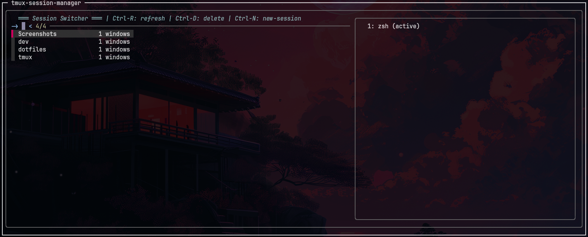

# tmux-session-manager

A fuzzy terminal popup to manage tmux sessions using `fzf`.



Just a simple and fast session manager for tmux — available as a plugin or standalone. It opens a popup using `fzf` where you can:

- View all other sessions (excluding your current one)
- See how many windows each has
- Switch to it or kill it with a keybind
- Create new-session and switch to the newly create session

---

## Requirements

- `tmux` 3.2 or higher (for `display-popup`)
- [`fzf`](https://github.com/junegunn/fzf)
- Common UNIX tools (`awk`, `bash`)

---

## Installation

### Via TPM (Tmux Plugin Manager)

1. Add plugin to your `~/.tmux.conf`:

```bash
set -g @plugin 'santoshxshrestha/tmux-session-manager'
```

2. Press `prefix` + `I` to install

### Manual Installation

1. Clone the repository:

```bash
git clone https://github.com/santoshxshrestha/tmux-session-manager ~/.tmux/plugins/tmux-session-manager
```

2. Add to your `~/.tmux.conf`:

```bash
run-shell ~/.tmux/plugins/tmux-session-manager/tmux-session-manager.tmux
```

3. Reload tmux config:

```bash
tmux source-file ~/.tmux.conf
```

### Quick Install (Standalone)

Add these lines to your ~/.tmux.conf:

```bash
 bind j display-popup -E -w 80% -h 60% -T ' tmux-session-manager ' '
  tmux list-sessions -F "#{session_name}|#{session_windows}|#{?session_attached,attached,detached}" |
  grep -v "^$(tmux display-message -p "#S")|" |
  awk -F"|" "{
    status = (\$3 == \"attached\") ? \"\" : \"\"
    printf \"%-20s %s %2s windows %s\\n\", \$1, status, \$2, \"\"
  }" |
  fzf --reverse \
      --prompt="-> " \
      --header="═══ Session Switcher ═══ | Ctrl-R: refresh | Ctrl-D: delete | Ctrl-N: new-session" \
      --header-first \
      --border=rounded \
      --color="header:italic" \
      --preview="tmux list-windows -t {1} -F \"  #{window_index}: #{window_name} #{?window_active,(active),}\"" \
      --preview-window="right:40%:wrap" \
      --bind="ctrl-r:reload(tmux list-sessions -F \"#{session_name}|#{session_windows}|#{?session_attached,attached,detached}\" | grep -v \"^\$(tmux display-message -p \"#S\")|\" | awk -F\"|\" \"{status = (\\\$3 == \\\"attached\\\") ? \\\"\\\" : \\\"\\\"; printf \\\"%-20s %s %2s windows %s\\\\n\\\", \\\$1, status, \\\$2, \\\"\\\"}\")" \
      --bind="ctrl-d:execute(tmux kill-session -t {1})+reload(tmux list-sessions -F \"#{session_name}|#{session_windows}|#{?session_attached,attached,detached}\" | grep -v \"^\$(tmux display-message -p \"#S\")|\" | awk -F\"|\" \"{status = (\\\$3 == \\\"attached\\\") ? \\\"\\\" : \\\"\\\"; printf \\\"%-20s %s %2s windows %s\\\\n\\\", \\\$1, status, \\\$2, \\\"\\\"}\")" \
      --bind="ctrl-n:execute(bash -c '\''echo -n -e \"== New tmux Session === \n Session Name ->  \" && read name && [ -n \"\$name\" ] && tmux new-session -d -s \"\$name\" 2>/dev/null && tmux switch-client -t \"\$name\"'\'')+abort" \
      --info=inline \
      --layout=reverse |
  awk "{print \$1}" |
  xargs -r tmux switch-client -t
'
```

Then reload your tmux config:

```bash
tmux source-file ~/.tmux.conf
```

## Usage

### Default Key Binding

- **Press `prefix` + `j`** to open the session manager

### Custom Key Binding

Add to your `~/.tmux.conf` to change the default key:

```bash
set -g @session_manager_key 'S'  # Use 'S' instead of 'j'
```

### Controls

Once opened:

- **Type to search** - Fuzzy find sessions by name
- **Enter** - Switch to selected session
- **Ctrl-R** - Refresh the session list
- **Ctrl-D** - Delete the selected session
- **Ctrl-N** - Create new-session and switch-client to newly created session
- **Esc** - Close without switching session

## Customization

### Available Options

```bash
# Key binding (default: 'j')
set -g @session_manager_key 'j'
```

### Manual Customization (Standalone)

Want to change the keybinding? Replace `j` with your preferred key:

```bash
bind j display-popup -E -w 80% -h 60% -T 'tmux-session-manager' '
```

Want a different popup size? Adjust the `-w` and `-h` values:

```bash
bind j display-popup -E -w <width> -h <height> -T 'tmux-session-manager' '
```

## Troubleshooting

**Popup doesn't appear?**

- Make sure you have tmux 3.2+: `tmux -V`
- Check if `display-popup` is available: `tmux list-commands | grep popup`

**fzf not found?**

- Install fzf: `brew install fzf` or `apt install fzf`
- Or follow the [official fzf installation guide](https://github.com/junegunn/fzf#installation)

**No sessions to switch to?**

- The manager only shows _other_ sessions (not your current one)
- Create more sessions: `tmux new-session -d -s mysession`

**Key binding conflicts?**

If `prefix + j` conflicts with existing bindings, change it:

```bash
set -g @session_manager_key 'your-preferred-key'
```

## 🤝 Contributing

Found a bug or have a feature idea? Feel free to open an issue or submit a PR!

## License

MIT License - [LICENSE](LICENSE) feel free to use this however you want!

---

**⭐ Star this repo if it made your tmux workflow better!**
